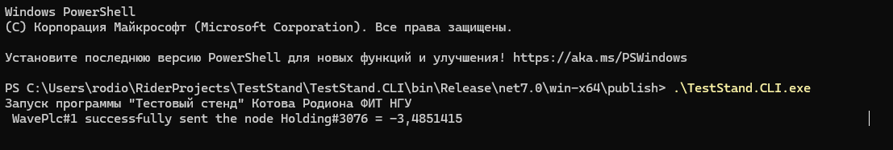

# Тестовый стенд интеллектуальных компонентов АСУ

## Назначение разработки

Так как получение данных из реальной системы на предприятиях в большинстве случаев противоречит политики безопасности,
было решено разработать программный комплекс для симуляции работы предприятия.

Тестовый стенд состоит из двух компонент: программы OPC – сервера (далее ```Диспетчер```) и программы, эмулирующей
показатели датчиков(далее ```Контроллер```).

В рамках разработки Тестового стенда компонент ```Диспетчера``` не разрабатывается – берется исходя из начальных
условий.

Тестовый стенд планируется использовать в качестве среды для
эмуляции [Modbus](https://wingpath.co.uk/docs/modbus_tcp_specification.pdf) трафика на уровне интеллектуальных устройств
АСУ по модели [Perdue](https://www.sci-hub.ru/10.1016/0166-3615%2894%2990017-5).

Взаимодействие в среде происходит между ПО диспетчерского управления – ```Диспетчером``` и эмулируемым программируемым
контроллером - ```Контроллером``` по установленному каналу связи, установленному в конфигурациях компонентов.

## Описание решения

### Программные компонеты

#### Платформа

[Microsoft .NET Core 7](https://dotnet.microsoft.com/en-us/download/dotnet/7.0)

#### Библитеки

| Название           | Версия         | Ссылка                                               |
|--------------------|----------------|------------------------------------------------------|
| ```NModbus```      | 4.0.0-alpha008 | [github](https://github.com/NModbus/NModbus)         |
| ```NModbusAsync``` | 2.1.3          | [nuget](https://www.nuget.org/packages/NModbusAsync) |

### Структура

#### Компонент ```Контроллера```

Решение ```Контроллера``` состоит из трех проектов

| Проекты              | Описание                                                       |  
|----------------------|----------------------------------------------------------------| 
| ```TestStand.CLI```  | Входная точка для пользователя                                 | 
| ```TestStand.Core``` | Реализации абстракций: Lectus-клиент и контроллер-осциллографа |  
| ```TestStand.Lib```  | Абстрации OPC-клиента и PLC эмулятора                          |  

#### Компонент ```Диспетчера```

Компонент основывается на программе [Lectus Modbus OPC/DDE server 3.10](https://lectussoft.com/opcserver.html)

Программа и конфигурация находятся в [архиве](execute/lectus.zip).

## Запуск

#### Компонент ```Контроллер```

Запускается через [исполняемый файл](execute/ConsoleApp.exe)

#### Компонент ```Диспетчер```

Запускается прорамма и открывается конфигурация из [архива](execute/lectus.zip)

## Тестирование

Программа Lectus отображает значение переменной

